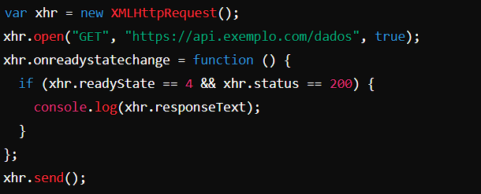
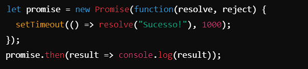
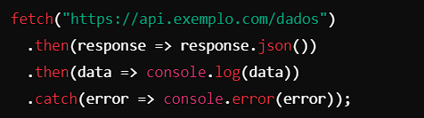
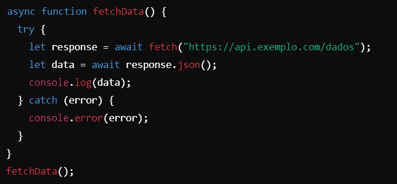
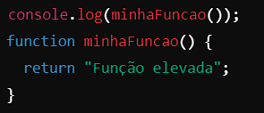
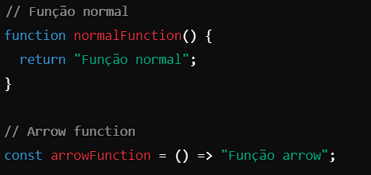
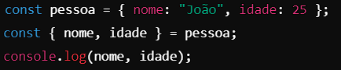
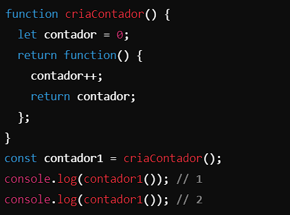

Codigos de Exemplo:

AJAX:

var xhr = new XMLHttpRequest();
xhr.open("GET", "https://api.exemplo.com/dados", true);
xhr.onreadystatechange = function () {
  if (xhr.readyState == 4 && xhr.status == 200) {
    console.log(xhr.responseText);
  }
};
xhr.send();

Promisses:

let promise = new Promise(function(resolve, reject) {
  setTimeout(() => resolve("Sucesso!"), 1000);
});
promise.then(result => console.log(result));

Fetch API:

fetch("https://api.exemplo.com/dados")
  .then(response => response.json())
  .then(data => console.log(data))
  .catch(error => console.error(error));

Async e Await:

async function fetchData() {
  try {
    let response = await fetch("https://api.exemplo.com/dados");
    let data = await response.json();
    console.log(data);
  } catch (error) {
    console.error(error);
  }
}
fetchData();

Hoisting:

console.log(minhaFuncao());
function minhaFuncao() {
  return "Função elevada";
}

Arrow Functions:

// Função normal
function normalFunction() {
  return "Função normal";
}

// Arrow function
const arrowFunction = () => "Função arrow";

Desestruturação (Destructuring):

const pessoa = { nome: "João", idade: 25 };
const { nome, idade } = pessoa;
console.log(nome, idade);

Closure:

function criaContador() {
  let contador = 0;
  return function() {
    contador++;
    return contador;
  };
}
const contador1 = criaContador();
console.log(contador1()); // 1
console.log(contador1()); // 2